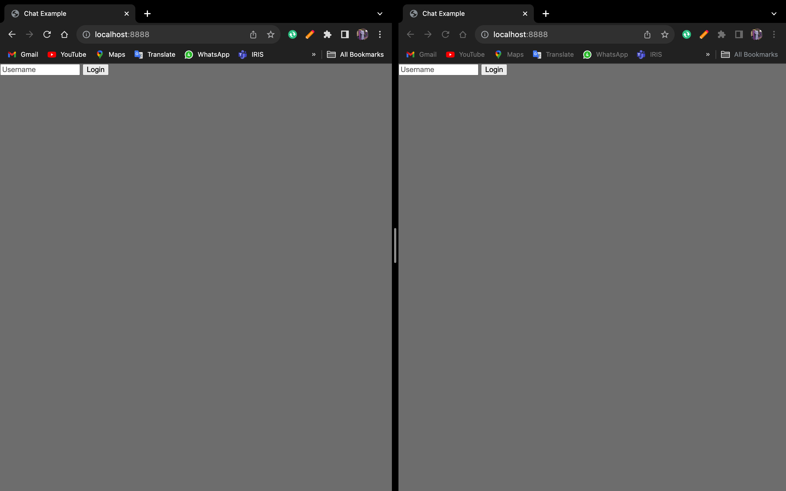
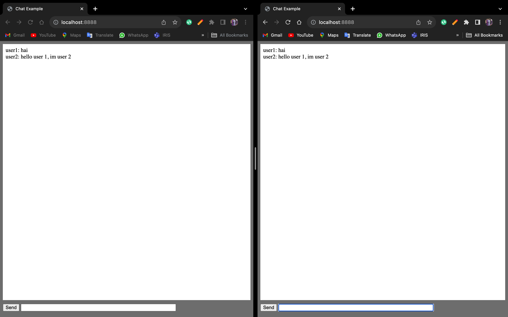

# SCREENSHOTS




# How To Use

```bash
git clone https://github.com/danendra10/gofiber-v2-websocket-chat-example

cd gofiber-v2-websocket-chat-example
chmod +x run.sh
./run.sh
```

# Credits

Huge thanks to the author of gofiber-websocket-chat-example
[check it out here](https://github.com/jos-/gofiber-websocket-chat-example/blob/master/main.go)
